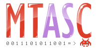

<div align="center">
  
  <p>Motion-Twin ActionScript 2 Compiler</p>
</div>

## About

MTASC is a free and open source ActionScript 2 compiler developed by [Nicolas Cannasse](https://github.com/ncannasse) at [Motion-Twin](https://web.archive.org/web/20081107145934if_/http://www.motion-twin.com/). It was widely used by many Flash professionals around the world.

MTASC does not require the Flash IDE: it will compile .as files into a .swf containing the flash bytecode. If you want to add additionnal resources, you can build an input SWF with open source tools such as [SWFMill](https://web.archive.org/web/20080830225116if_/http://swfmill.org/) or [FlashDevelop](https://github.com/fdorg/flashdevelop).

You can read more about MTASC on [mtasc.org](https://web.archive.org/web/20080831102402/http://mtasc.org/).

## Requirements

- [OCaml](https://github.com/ocaml/ocaml) 3

> [!TIP]
> Use [opam](https://github.com/ocaml/opam) to switch between OCaml versions with ease.

## Installation

Clone this repository and run:
```
ocaml install.ml
```
> [!NOTE]
> Precompiled binaries can be found [here](https://github.com/dofera/mtasc/releases).

## Usage

```
mtasc -swf <output.swf> -main -header <width:height:fps:bgcolor> <Input.as>
```

For advanced usage, see [here](https://web.archive.org/web/20080831102402if_/http://mtasc.org/#usage).

## Example

```actionscript
// HelloWorld.as

class HelloWorld {

  static var app:HelloWorld;

  function HelloWorld() {
    _root.createTextField("tf", 0, 0, 0, 640, 480);
    _root.tf.text = "Hello, World!";
  }

  static function main(mc) {
    app = new HelloWorld();
  }
}
```

```
mtasc -swf helloworld.swf -main -header 800:600:20 HelloWorld.as
```
